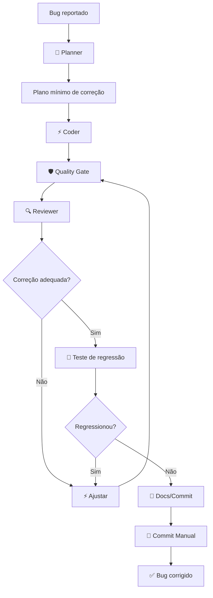

# Bugfix Flow — Corrigir bug

## Diagrama visual do fluxo



## Ciclo completo (8 etapas)

### Etapa 1: Criar branch

```powershell
git checkout -b fix/descricao-do-bug
```

### Etapa 2: Descrever o bug

Documente claramente:

```powershell
# Atue como **Planner** (.ai-flow/agents/planner.md)

## Descrição do bug
[O que acontece? Comportamento esperado vs real]

## Reprodução
1. [Passo 1]
2. [Passo 2]
3. [Passo 3]

## Hipótese da causa
[O que você acha que está causando o problema?]

## Plano mínimo
Proponha o plano MÍNIMO necessário para corrigir este bug.
Sem refatorações. Sem melhorias. Apenas a correção.
```

### Etapa 3: Aprovar plano de correção

- O plano deve ser **mínimo** — resolva o bug, nada mais
- Se houver risco de regressão, anote

### Etapa 4: Implementar a correção

```
Atue como **Coder** (.ai-flow/agents/coder.md).

Plano de correção aprovado:

[COLE O PLANO AQUI]

IMPORTANTE: Esta é uma correção de bug. Seja minimalista.
Corrija apenas o problema descrito. Não refatore.
```

### Etapa 5: Quality gate

```powershell
python .ai-flow\scripts\quality-gate.py
```

### Etapa 6: Reviewer

```
Atue como **Reviewer / Quality Gate** (.ai-flow/agents/reviewer-quality-gate.md).

Analise o git diff abaixo. Esta é uma correção de bug — verifique se:
1. A correção resolve a causa raiz
2. Não introduz efeitos colaterais
3. O código é minimalista
4. Existem testes de regressão

[Cole o output de `git diff` aqui]
```

### Etapa 7: Teste de regressão

```
Atue como **Tester** (.ai-flow/agents/tester.md).

Execute os testes existentes para garantir que a correção não quebrou
nada. Foco em regressão. Execute também o lint e typecheck.

Projeto: Node.js + React
```

### Etapa 8: Commit

```
Atue como **Docs & Commit** (.ai-flow/agents/docs-commit.md).

Leia o diff e gere mensagem de commit no formato:
fix(escopo): descrição concisa do bug corrigido
```

```powershell
git add .
git commit -m "fix(escopo): descrição"
```

---

## Regras específicas para bugfix

| Regra | Descrição |
|-------|-----------|
| **Minimalista** | Altere o mínimo possível para corrigir |
| **Sem refatoração** | Não melhore código adjacente |
| **Teste de regressão** | Obrigatório antes do commit |
| **Causa raiz** | Certifique-se de que a correção ataca a causa, não o sintoma |
| **Um bug por branch** | Nunca misture correções diferentes na mesma branch |
