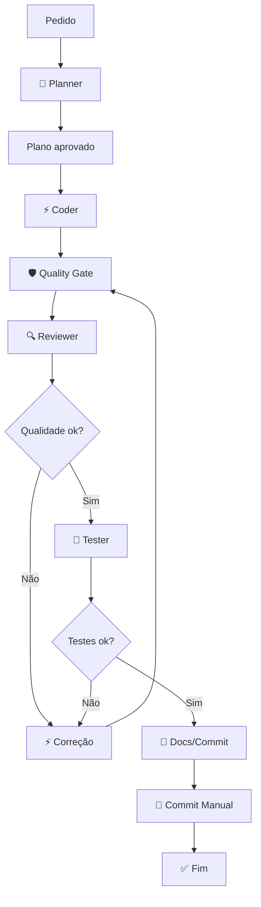

# Feature Flow — Criar nova funcionalidade

## Diagrama visual do fluxo



## Ciclo completo (10 etapas)

### Etapa 1: Criar branch

```powershell
git checkout -b feature/minha-funcionalidade
```

### Etapa 2: Chamar o Planner

Copie e cole este prompt para o agente Planner:

```
Atue como **Planner** (arquivo .ai-flow/agents/planner.md).

Preciso implementar a seguinte funcionalidade:

[DESCREVA A FUNCIONALIDADE AQUI]

Analise o projeto, identifique os arquivos afetados, avalie riscos e
proponha um plano de implementação detalhado. Não edite nenhum arquivo.
```

### Etapa 3: Analisar e aprovar o plano

- Leia o plano gerado
- Aprove, peça ajustes ou recuse
- **Só prossiga com o plano aprovado**

### Etapa 4: Chamar o Coder

Copie e cole para o agente Coder:

```
Atue como **Coder** (arquivo .ai-flow/agents/coder.md).

Plano aprovado:

[COLE O PLANO AQUI]

Implemente cada passo do plano. Siga as regras de segurança:
- Nunca faça commit automático
- Mantenha o estilo do projeto
- Uma mudança por vez
- Não altere arquivos fora do escopo
```

### Etapa 5: Rodar quality gate

```powershell
python .ai-flow\scripts\quality-gate.py
```

Ou pelo atalho:

```powershell
.ai-flow\scripts\run-quality-gate.ps1
```

### Etapa 6: Chamar o Reviewer

Copie e cole para o agente Reviewer:

```
Atue como **Reviewer / Quality Gate** (arquivo .ai-flow/agents/reviewer-quality-gate.md).

Analise o git diff abaixo e o relatório do quality gate (veja o HTML em
.ai-flow/reports/quality-gate.html). Aponte problemas críticos, importantes
e melhorias. Não edite código.

[Cole o output de `git diff` aqui]
```

### Etapa 7: Corrigir problemas

Se o reviewer apontou problemas, reenvie ao Coder:

```
Atue como **Coder** (arquivo .ai-flow/agents/coder.md).

Corrija os seguintes problemas apontados pelo reviewer:

[COLE OS PROBLEMAS AQUI]

Mantenha as mesmas regras de segurança.
```

Repita as etapas 5-7 até o quality gate estar satisfatório.

### Etapa 8: Rodar Tester

Copie e cole para o agente Tester:

```
Atue como **Tester** (arquivo .ai-flow/agents/tester.md).

Execute os comandos de teste, lint e build do projeto. Relate erros
e sugira correções. Não altere código.

Projeto: Node.js + React
```

Se houver erros, volte para a Etapa 7.

### Etapa 9: Chamar Docs/Commit

Copie e cole para o agente Docs & Commit:

```
Atue como **Docs & Commit** (arquivo .ai-flow/agents/docs-commit.md).

Leia o git diff final e gere:
1. Resumo das alterações
2. Mensagem de commit (Conventional Commits)
3. Descrição para PR

[Cole o output de `git diff` aqui]
```

### Etapa 10: Commit manual

```powershell
git add .
git commit -m "tipo(escopo): descrição"
```

**Nunca faça commit automático.** Revise o `git diff --cached` antes de commitar.

---

## Diagrama do fluxo

```
[Pedido] → Planner → [Plano aprovado] → Coder → Quality Gate → Reviewer
                                                          ↓
                                                     [Problemas?] → Coder →
                                                          ↓
                                                     [OK] → Tester → [OK] → Docs/Commit
                                                              ↓
                                                         [Erro] → Coder
```
