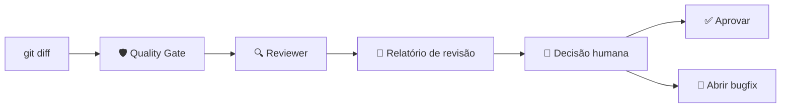

# Review Flow — Revisar código existente

## Diagrama visual do fluxo



## Objetivo

Revisar código já implementado (via `git diff`) **sem fazer alterações**. Útil para:
- Code review antes de merge
- Revisão de PRs abertos
- Auditoria de qualidade periódica
- Segunda opinião em código crítico

## Fluxo (3 etapas)

### Etapa 1: Obter o diff

```powershell
# Diff completo contra a branch base
git diff main

# Ou diff do último commit
git diff HEAD~1

# Ou diff de um commit específico
git diff <commit1>..<commit2>
```

Salve o diff em um arquivo para referência:

```powershell
git diff main > .ai-flow\reviews\review-diff.txt
```

### Etapa 2: Quality gate

```powershell
python .ai-flow\scripts\quality-gate.py
```

### Etapa 3: Chamar o Reviewer

Copie e cole para o agente Reviewer:

```
Atue como **Reviewer / Quality Gate** (arquivo .ai-flow/agents/reviewer-quality-gate.md).

Analise exclusivamente o código abaixo (git diff). Não proponha
alterações — apenas aponte problemas, riscos e sugestões.

Contexto da revisão:
- Projeto: Node.js + React
- Tipo: [nova funcionalidade / correção / refatoração]
- Prioridade: [alta / média / baixa]

Relatório do quality gate disponível em: .ai-flow/reports/quality-gate.html

[Cole o output do `git diff` aqui]
```

## Formato de saída esperado

O Reviewer deve gerar:

```
## Nota geral de qualidade: X/10

## Problemas críticos (precisa corrigir antes de merge)
- ...

## Problemas importantes (corrigir idealmente)
- ...

## Melhorias opcionais (para próximas iterações)
- ...

## Decisão final
[APROVADO] / [REPROVADO] / [APROVADO COM RESSALVAS]
```

## Opcional: gerar relatório de qualidade

Se quiser um documento permanente, salve a saída do reviewer:

```powershell
# No PowerShell
git diff main | python .ai-flow\scripts\quality-gate.py
# Depois copie a resposta do reviewer para:
New-Item -Path ".ai-flow\reports\review-$(Get-Date -Format 'yyyyMMdd-HHmmss').md" -ItemType File
```

## Regras

- **Nenhum arquivo deve ser editado** durante este fluxo
- O reviewer não sugere implementação, apenas análise
- A decisão final é **humana** — o reviewer é uma ferramenta de apoio
- Se o reviewer apontar problemas críticos, considere abrir um bugfix flow
